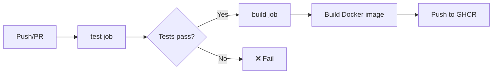
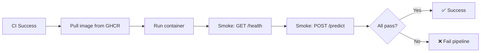

# MLOps Cats vs Dogs — Complete Runbook

This runbook covers every step to set up, train, deploy, test, monitor, and submit the project.

---

## Prerequisites

| Tool | Version | Purpose |
|------|---------|---------|
| Python | 3.10+ (3.11 recommended) | All scripts |
| Git | Any | Source control |
| Docker | 20+ | Containerization |
| Docker Compose | v2+ | Multi-container deployment |
| kind | 0.20+ | Local Kubernetes (optional) |
| kubectl | 1.28+ | K8s CLI (optional) |

---

## 1 · Clone & Setup

```powershell
# Clone
git clone https://github.com/shahrukhsaba/mlops-cats-vs-dogs.git
cd mlops-cats-vs-dogs

# Virtual environment
python -m venv venv
.\venv\Scripts\activate        # Windows
# source venv/bin/activate     # Linux/macOS

# Install dependencies
pip install -r requirements.txt
```

---

## 2 · Data Download & Preparation (M1)

### Option A — kagglehub (no API key)
```powershell
pip install kagglehub
$env:PYTHONPATH="."
python scripts/download_data.py
```

### Option B — Manual download
1. Download from [Kaggle](https://www.kaggle.com/datasets/bhavikjikadara/dog-and-cat-classification-dataset)
2. Extract into `data/raw/` so structure is `data/raw/cats/` and `data/raw/dogs/`

### Prepare splits
```powershell
$env:PYTHONPATH="."
python scripts/prepare_data.py
```

**Output:** `data/processed/splits.json` with 80/10/10 train/val/test split.

### DVC tracking
```powershell
dvc init          # already done in repo
dvc add data/raw  # track raw data
dvc repro         # run full pipeline (prepare → train)
```

---

## 3 · Model Training with MLflow (M1)

### Standard training
```powershell
$env:PYTHONPATH="."
python scripts/train.py --epochs 5
```

### Fast mode (quick verification)
```powershell
$env:PYTHONPATH="."
python scripts/train.py --fast
```

### Custom parameters
```powershell
$env:PYTHONPATH="."
python scripts/train.py --epochs 12 --batch-size 32 --lr 0.001
```

**Output:** `models/model.pt`

### View MLflow experiments
```powershell
mlflow ui
# Open http://localhost:5000 in browser
```

**Logged artifacts:** params, train_loss, val_loss, val_acc, confusion_matrix.json, history.json, model artifact

---

## 4 · Run the API (M2)

### Option A — Uvicorn (bare-metal)
```powershell
$env:PYTHONPATH="."
uvicorn api.main:app --host 0.0.0.0 --port 8000
```

### Option B — Docker
```powershell
docker build -t cats-vs-dogs-api:latest .
docker run -p 8000:8000 cats-vs-dogs-api:latest
```

### Option C — Docker Compose
```powershell
docker compose up -d
```

### Verify the API
```powershell
# Health check
curl http://localhost:8000/health

# Prediction (PowerShell)
curl.exe -X POST http://localhost:8000/predict -F "file=@path/to/cat.jpg"

# Swagger UI
# Open http://localhost:8000/docs
```

### API Endpoints

| Method | Path | Description |
|--------|------|-------------|
| GET | `/` | Landing page with links |
| GET | `/health` | Health check |
| POST | `/predict` | Image classification (multipart: [file](file:///c:/Users/koush/OneDrive/Documents/BITS%20Pilani/MLOPS/Assignment2/mlops-cats-vs-dogs/Dockerfile)) |
| GET | `/metrics` | Prometheus-format metrics |
| GET | `/docs` | Swagger UI |

---

## 5 · Unit Tests (M3)

```powershell
# Run all tests
pytest tests/ -v

# With coverage
pytest tests/ -v --cov=src --cov-report=term-missing
```

### Test files

| File | Tests |
|------|-------|
| `tests/test_preprocess.py` | Image loading/resizing, split ratios, normalize |
| `tests/test_inference.py` | Model loading, predict_proba, predict_label, preprocess_image |

---

## 6 · CI Pipeline — GitHub Actions (M3)

### Workflow: `.github/workflows/ci.yml`

**Trigger:** Push or PR to `main` / `master`



**Steps:**
1. Checkout repository
2. Setup Python 3.11
3. Install dependencies
4. Run `pytest tests/ -v`
5. Create placeholder model for Docker build
6. Build & push Docker image to `ghcr.io/<org>/mlops-cats-vs-dogs`

### Workflow: `.github/workflows/release.yml`

**Trigger:** Push tag `v*` or manual dispatch

1. Checkout, install deps + kagglehub
2. Download dataset → Prepare data → Train model
3. Create GitHub Release with `model.pt` attached
4. Optionally upload to Artifactory

---

## 7 · CD Pipeline — GitHub Actions (M4)

### Workflow: `.github/workflows/cd.yml`

**Trigger:** After CI workflow completes successfully on `main`/`master`



**Steps:**
1. Log in to GHCR
2. Pull the newly built image
3. `docker run -d -p 8000:8000`
4. Smoke test: `curl /health`
5. Smoke test: `curl /predict` with synthetic image
6. Stop container (always)

---

## 8 · Kubernetes Deployment (M4)

### One-command deploy with kind
```bash
./scripts/deploy_k8s.sh
```
This will: build Docker image → create `kind` cluster → load image → apply K8s manifests → port-forward to `localhost:8000`.

### Manual K8s deploy
```powershell
# Build image
docker build -t cats-vs-dogs-api:latest .

# Create kind cluster
kind create cluster --name cats-vs-dogs

# Load image into kind
kind load docker-image cats-vs-dogs-api:latest --name cats-vs-dogs

# Apply manifests
kubectl apply -f k8s/

# Wait for rollout
kubectl rollout status deployment/cats-vs-dogs-api --timeout=120s

# Port-forward
kubectl port-forward svc/cats-vs-dogs-api 8000:8000
```

### K8s Manifests

| File | Type | Details |
|------|------|---------|
| `k8s/deployment.yaml` | Deployment | 1 replica, health probes, resource limits |
| `k8s/service.yaml` | Service | ClusterIP on port 8000 |

---

## 9 · Smoke Tests (M4)

```bash
# Run standalone smoke test script
./scripts/smoke_test.sh http://localhost:8000
```

Tests:
1. `GET /health` — must return 200
2. `POST /predict` — with synthetic 224×224 image, must return 200 with label

---

## 10 · Monitoring Stack — Prometheus + Grafana (M5)

### Start monitoring
```powershell
docker compose -f monitoring/docker-compose-monitoring.yml up -d
```

### Access points

| Service | URL | Credentials |
|---------|-----|-------------|
| API | http://localhost:8000 | — |
| Prometheus | http://localhost:9090 | — |
| Grafana | http://localhost:3000 | admin / admin |

### Available Prometheus metrics

| Metric | Type |
|--------|------|
| `app_info` | gauge |
| `app_uptime_seconds` | gauge |
| `model_loaded` | gauge |
| `predictions_total` | counter |
| `request_count_total` | counter |
| `prediction_latency_avg_ms` | gauge |

### Stop monitoring
```powershell
docker compose -f monitoring/docker-compose-monitoring.yml down
```

---

## 11 · Post-Deployment Performance Tracking (M5)

```powershell
$env:PYTHONPATH="."
python scripts/collect_predictions.py --max-samples 20
```

**Output:** `predictions_batch.json` with fields: `path`, `true_label`, `pred_label`, `probabilities`, `correct`, plus accuracy summary.

---

## 12 · Render Cloud Deployment

The API is live at: **https://mlops-cats-vs-dogs.onrender.com/**

### Deploy to Render
1. Create a new Web Service on [Render](https://render.com)
2. Connect to the GitHub repository
3. Set environment variable: `MODEL_URL` = URL to `model.pt` (e.g., from GitHub Release)
4. Deploy using `Dockerfile`

---

## 13 · DVC Pipeline (E2E reproducibility)

```powershell
# Full pipeline: prepare → train
dvc repro

# Show pipeline graph
dvc dag

# Push data to remote (if configured)
dvc push
```

### DVC Stages

| Stage | Command | Input | Output |
|-------|---------|-------|--------|
| `prepare` | `python scripts/prepare_data.py` | `data/raw/`, `src/data/preprocess.py` | `data/processed/splits.json` |
| `train` | `python scripts/train.py` | `splits.json`, `src/model/cnn.py` | `models/model.pt` |

---

## 14 · Complete E2E Workflow Sequence

The following is the full sequence for a complete demo (suitable for screen recording):

```powershell
# 1. Setup
git clone <repo> && cd mlops-cats-vs-dogs
python -m venv venv && .\venv\Scripts\activate
pip install -r requirements.txt

# 2. Data
pip install kagglehub
$env:PYTHONPATH="."
python scripts/download_data.py
python scripts/prepare_data.py

# 3. Train
python scripts/train.py --fast

# 4. Unit Tests
pytest tests/ -v

# 5. Run API locally
uvicorn api.main:app --port 8000
# (In another terminal) Verify:
curl http://localhost:8000/health
curl -X POST http://localhost:8000/predict -F "file=@data/raw/cats/cat.0.jpg"

# 6. Docker
docker build -t cats-vs-dogs-api:latest .
docker run -p 8000:8000 cats-vs-dogs-api:latest

# 7. Monitoring
docker compose -f monitoring/docker-compose-monitoring.yml up -d
# Open Grafana at http://localhost:3000

# 8. Post-deploy tracking
python scripts/collect_predictions.py

# 9. Git push → triggers CI → CD
git add . && git commit -m "update" && git push
```

---

## 15 · Deliverables Checklist

| # | Deliverable | Status | Location |
|---|-------------|--------|----------|
| 1 | Source code | ✅ | `src/`, `api/`, `scripts/` |
| 2 | DVC configs | ✅ | `dvc.yaml`, `params.yaml`, `.dvc/`, `data/raw.dvc` |
| 3 | CI/CD configs | ✅ | `.github/workflows/ci.yml`, `cd.yml`, `release.yml` |
| 4 | Dockerfile | ✅ | `Dockerfile` |
| 5 | docker-compose.yml | ✅ | `docker-compose.yml` |
| 6 | K8s manifests | ✅ | `k8s/deployment.yaml`, `k8s/service.yaml` |
| 7 | Trained model | ✅ | `models/model.pt` (after training) |
| 8 | requirements.txt | ✅ | `requirements.txt` (pinned) |
| 9 | Unit tests | ✅ | `tests/test_preprocess.py`, `tests/test_inference.py` |
| 10 | Screen recording (< 5 min) | ⚠️ Pending | Needs to be created |
| 11 | Assignment report | ✅ | `reports/MLOps_Assignment2_Report.md` |

---

## File Reference Map

```
mlops-cats-vs-dogs/
├── api/main.py                          # FastAPI service (M2)
├── src/
│   ├── config.py                        # Constants & paths
│   ├── data/preprocess.py               # Image loading, splitting (M1)
│   ├── model/cnn.py                     # SimpleCNN architecture (M1)
│   └── inference/predict.py             # Model loading & prediction (M2)
├── scripts/
│   ├── download_data.py                 # Dataset download (M1)
│   ├── prepare_data.py                  # Train/val/test splits (M1)
│   ├── train.py                         # Training + MLflow (M1)
│   ├── smoke_test.sh                    # Post-deploy smoke tests (M4)
│   ├── deploy_k8s.sh                    # K8s one-command deploy (M4)
│   └── collect_predictions.py           # Post-deploy evaluation (M5)
├── tests/
│   ├── test_preprocess.py               # Data preprocessing tests (M3)
│   └── test_inference.py                # Inference function tests (M3)
├── .github/workflows/
│   ├── ci.yml                           # CI: test + build + push (M3)
│   ├── cd.yml                           # CD: deploy + smoke test (M4)
│   └── release.yml                      # Release: train + publish
├── k8s/
│   ├── deployment.yaml                  # K8s Deployment (M4)
│   └── service.yaml                     # K8s Service (M4)
├── monitoring/
│   ├── docker-compose-monitoring.yml    # Prometheus + Grafana (M5)
│   ├── prometheus/prometheus.yml        # Scrape config (M5)
│   └── grafana/                         # Dashboards + datasources (M5)
├── Dockerfile                           # Container image (M2)
├── docker-compose.yml                   # Local deployment (M4)
├── dvc.yaml                             # DVC pipeline (M1)
├── params.yaml                          # Training parameters (M1)
└── requirements.txt                     # Pinned dependencies (M2)
```
